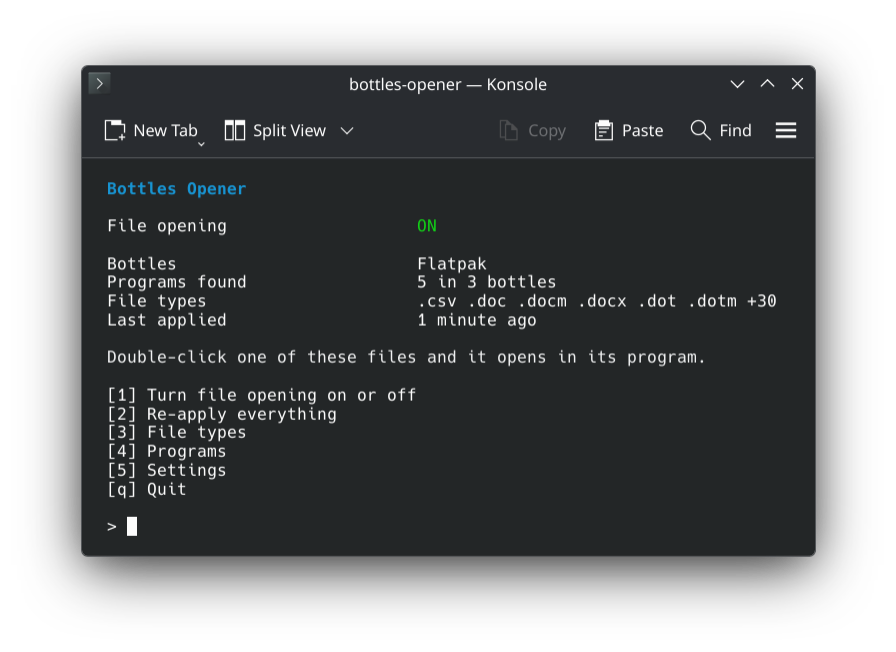
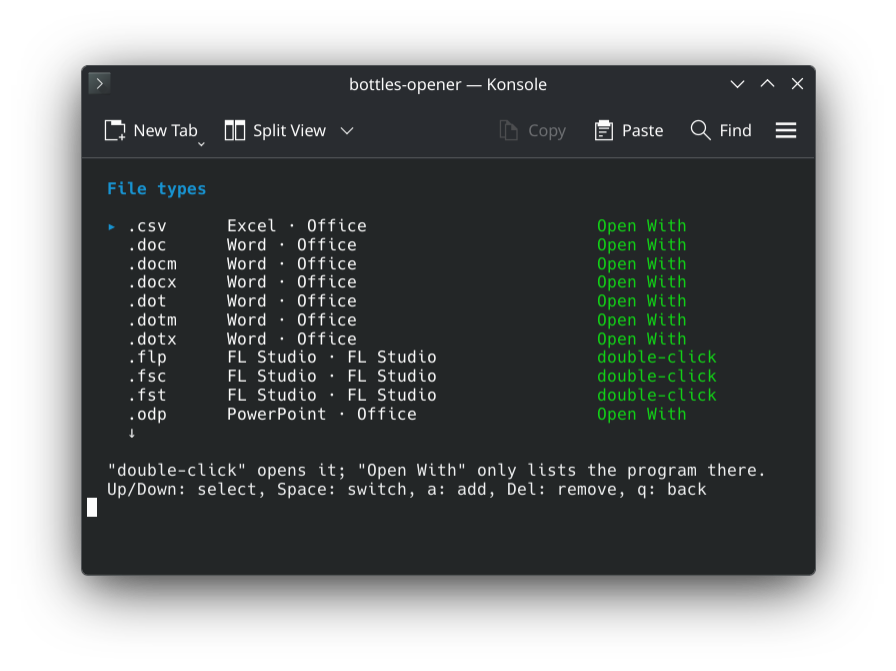

<p align="center">
  
</p>

<h1 align="center">bottles-opener</h1>

<h3 align="center">Double-click a file and it opens in its Windows program.</h3>

<p align="center">
  FL Studio, Office, Photoshop, Ableton and anything else you run in <a href="https://usebottles.com">Bottles</a>.
</p>

<h5 align="center">
  <a href="#install">Install</a> |
  <a href="#how-to-use">How to use</a> |
  <a href="https://github.com/LoonixTools/bottles-opener/issues">Report a bug</a>
</h5>

<p align="center">
  <a href="https://buymeacoffee.com/felitendo"></a>
</p>

## Install

```bash
yay -S bottles-opener
```

Needs `python3` with PyYAML and icoextract. Bottles needs both too.

## How to use

```bash
bottles-opener
```

<p align="center">
  
</p>

Press **1**. Your files _✨just open✨_ in their program, like on Windows.

<details>
<summary>File types</summary>

**3** lists every file type. Space switches between:

| | |
|---|---|
| double-click | Opens it in the program |
| Open With | Only listed in the right-click menu (when another app already opens it) |

<p align="center">
  
</p>

Your own file types: `bottles-opener add flp,fst "FL Studio"`

</details>

## More

<details>
<summary>How it works</summary>

| | |
|---|---|
| File types | Read from the bottle's registry, like Windows does. Known programs without entries come from a built-in list. |
| Icons | The ones Windows shows, taken from the program. |
| Opening | With the Windows path and the program's own switches, through `bottles-cli`. |
| Undo | `bottles-opener disable` puts back exactly what was there. |

Bottles 67 has file associations too, but it refuses extensions your system does not know (like
`.flp`), passes Linux paths and leaves the icons alone.

</details>

<details>
<summary>Commands</summary>

| | |
|---|---|
| `bottles-opener` | The menu |
| `… enable` | Turn on |
| `… disable` | Undo everything |
| `… apply` | Pick up new programs |
| `… status` | What is set up |
| `… list` | All file types and what opens them |
| `… programs` | All programs and their file types |
| `… add <ext,...> <program> [bottle]` | Open file types with a program |
| `… remove <ext,...> [program]` | Stop opening file types |

</details>

<details>
<summary>Build from source</summary>

```bash
make
sudo make install
bottles-opener enable
```

`make install PREFIX=~/.local` works without root.

</details>

GPL-3.0-or-later.
